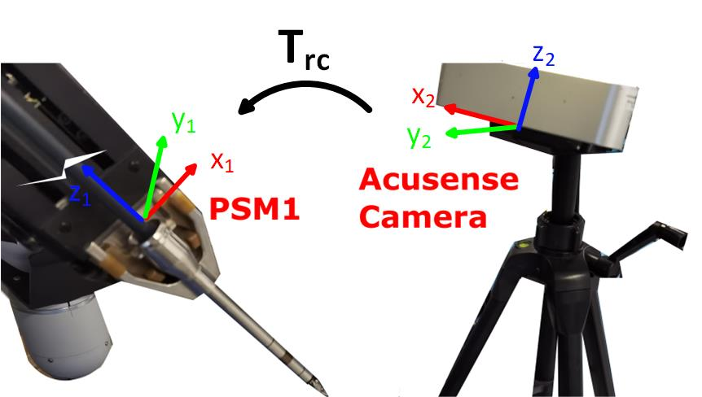
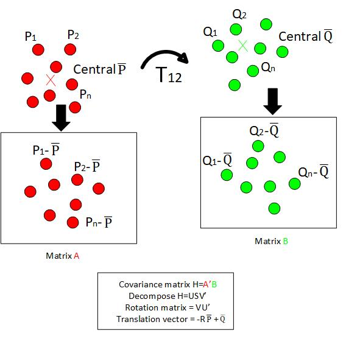
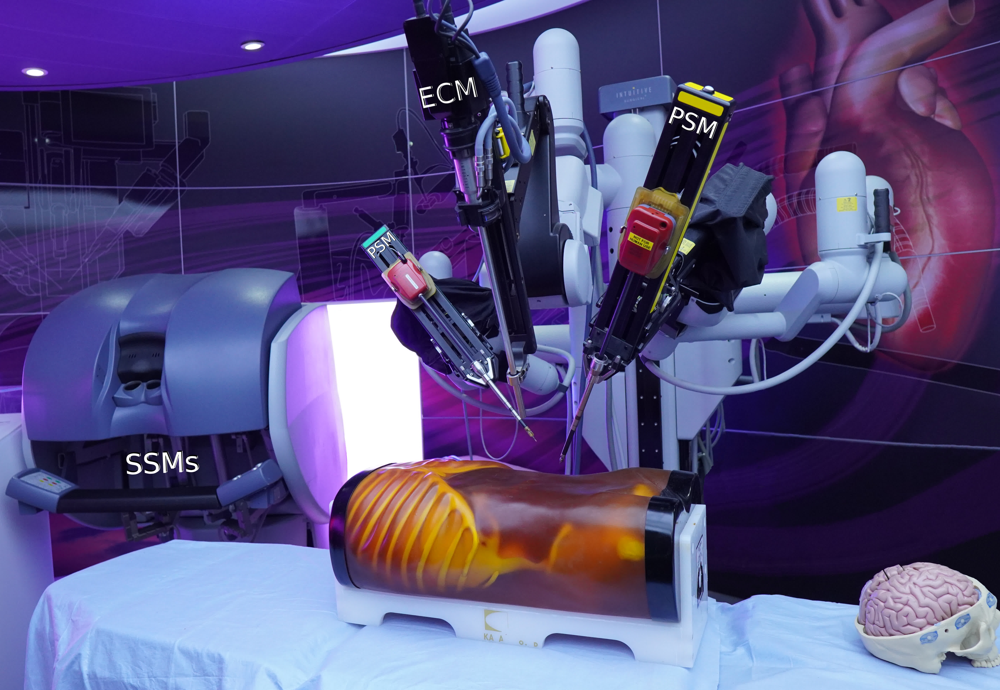
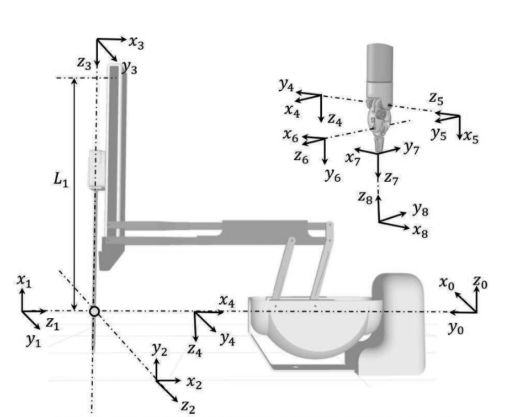
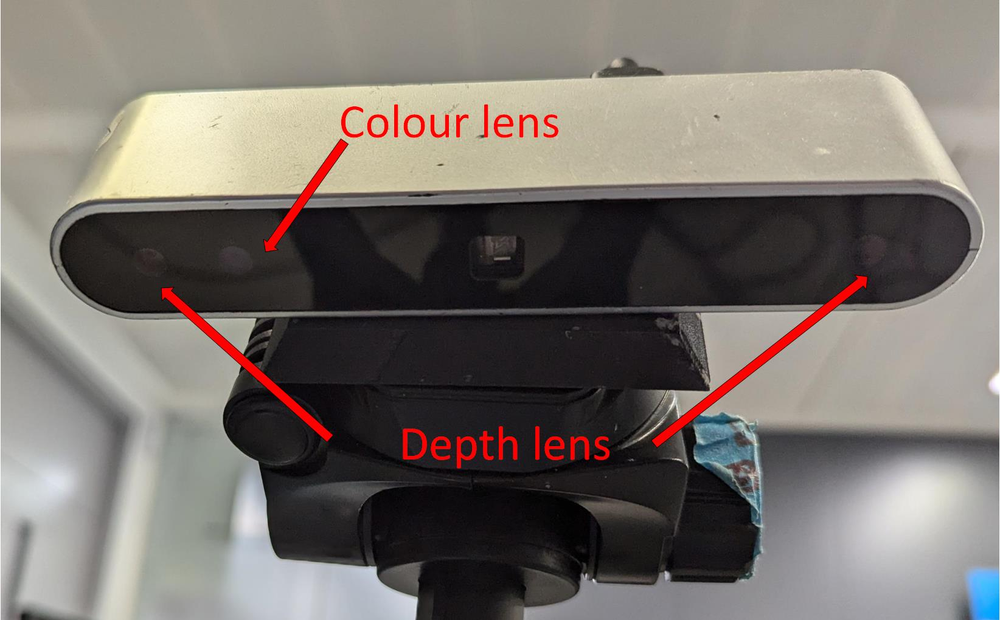
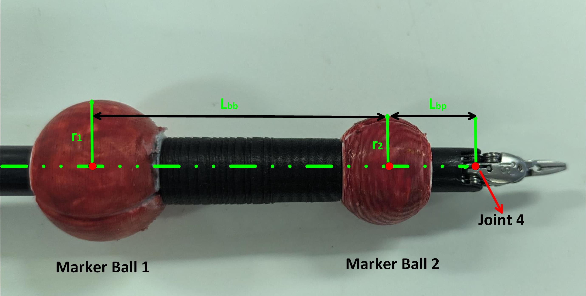

# Background

## Hand-eye calibration
Hand-eye calibration is a well-studied research topic in the field of robotics. It aims to find the transformation matrix from the camera frame to the base frame of the robot (Fig 1). 

<!--- 

      
    Fig 1. Hand-eye calibration  

 -->

| |
|:--:|
| Fig 1. Hand-eye calibration |

It is an essential procedure for applications that involve the use of cameras because it helps align the camera frame with the robot frame, such that the robot can be commanded to move to a specific position indicated by the camera. Typically, hand-eye calibration problem is treated as an $\mathbf{AX=XB}$ [[1]](#1) or $\mathbf{AX=YB}$ [[2]](#2) problem, where $\mathbf{X}$ represents the unknown transformation matrix, and $\mathbf{A,B}$ matrices are related to the poses of the robot and camera. Depending on application scenarios, hand-eye calibration algorithms can be divided into marker-based and marker-free approaches, where markers provide easy access to obtaining camera poses. Although marker-based approaches provide higher accuracy, they are usually not suitable to be used for a clinical setup, and hence are constrained to a lab setup. Alternatively, hand-eye calibration can also be treated as a registration problem, where the transformation matrix is found by registering one set of points expressed in one coordinate frame to the same set of points expressed in another frame. In this project, we address hand-eye calibration problem according to the latter school of thought.

## Point set registration through Singular Value Decomposition (SVD)
When correspondences are known between two point sets, the transformation matrix can be analytically calculated using the algorithm proposed in [[3]](#3). A brief summary of the algorithm is listed below. [This link](https://www.youtube.com/watch?v=dhzLQfDBx2Q) provides a video tutorial explaining this algorithm. Fig 2. is a graphical demonstration of the algorithm.

Assume there are two sets of points $\tilde{P}$={ $P_1$, $P_2$ ..., $P_n$ } and $\tilde{Q}$={ $Q_1$, $Q_2$ ..., $Q_n$ }, where set $\tilde{Q}$ is set $\tilde{P}$ after being applied with a rigid transformation matrix $\mathbf{T_{12}}$. To find $\mathbf{T_{12}}$, the algorithm goes as follows:

### Step 1. Find the central position for set $\tilde{P}$ and $\tilde{Q}$
We denote the central positions $\overline{P}=\frac{1}{n} \displaystyle \sum_{i=1}^{n} P_i$ and $\overline{Q}=\frac{1}{n} \displaystyle \sum_{i=1}^{n} Q_i$, then we update the two point sets as $\tilde{P}$={ $P_1-\overline{P}$, $P_2-\overline{P}$ ..., $P_n-\overline{P}$ } and $\tilde{Q}$={ $Q_1-\overline{Q}$, $Q_2-\overline{Q}$ ..., $Q_n-\overline{Q}$ }. To facilitate further calculation, we use matrices to store these points. Matrix $\mathbf{A}$ is used to represent the updated point set $\tilde{P}$, and matrix $\mathbf{B}$ for the updated point set $\tilde{Q}$. Both $\mathbf{A}$ and $\mathbf{B}$ are $\textrm{n} \times \textrm{3}$ matrices, where each row stores the position of a 3D point.

### Step 2. Implement SVD on the convariance matrix
We construct the covariance matrix $\mathbf{H=A'B}$. Then we perform SVD on $\mathbf{H}$, and hence $\mathbf{H=USV'}$. 

### Step 3. Reconstruct $\mathbf{T_{12}}$
The rotational component of $\mathbf{T_{12}}$ can be found as $\mathbf{R=VU'}$, and the translational component of $\mathbf{T_{12}}$ can be found as $t=- \mathbf{R} \overline{P} + \overline{Q}$

<!---

      
    Fig 2. Algorithm for finding the hand-eye transformation matrix  

--->

| |
|:--:|
| Fig 2. Algorithm for finding the hand-eye transformation matrix |

## Robot forward kinematics
In robotics, we describe the status of a robot in either the joint space or Cartesian space. The joint space describes robot pose relative to joint coordinate frames, while the Cartesian space describes robot pose relative to the base frame of the robot $\mathrm{O_0}$. Different combinations of joint positions result in different poses of a robot, and this relationship is described by forward kinematics. Forward kinematics depends on both the joint status and the mechanical parameters of a robot, which are called Denavit-Hartenberg (DH) parameters. The selection DH parameters depends on how joint coordinate frames are established and hence is not unique to a robot. The selection of DH parameters can be referred to [[4]](#4). From DH parameters, we can construct a $\textrm{4} \times \textrm{4}$ matrix $\mathbf{T_{i,i+1}}$ to describe the transformation between two adjacent joint coordinate frames $\mathrm{O_i}$ and $\mathrm{O_{i+1}}$. Therefore, with knowledge of the forward kinematics and the position of point $P_j$ in joint $\textrm{j}$ coordinate frame, we can recover its position in the robot base frame $P_0$ as $$ P_0 = \prod_{k=0}^{j-1} \mathbf{T_{k,k+1}} P_j $$

## Experimental setup

### 1. The first-generation da Vinci Research Kit (dVRK)

#### a) Overview

The first-generation dVRKs are repurposed out of retired first-generation da Vinci robots (Intuitive Surgical Inc, Sunnyvale, California) that are no longer used in the clinical theatre, and redistrubuted institutions for research and trainings. The da Vinci robot is a tele-operative surgical platform for minimally invasive surgery. A full da Vinci system consists of one Surgeon Side Manipulator (SSM), one Endoscopic Camera Manipulator (ECM), and three Patient Side Manipulators (PSM) (Fig 3). It enables surgeons to operate on the SSM side whilst the surgical instruments mounted on the PSMs are replicating the hand movements of the surgeon.

<!---

      
    Fig 3. The first generation da Vinci Research Kit (dVRK)  

--->

| |
|:--:|
| Fig 3. The first generation da Vinci Research Kit (dVRK) |

Although different surgeries require using different surgical instruments, their DH parameters are the same. The definition of joint coordinate frames is shown below (Fig 4, reproduced from [[5]](#5)).

<!---

      
    Fig 4. Definition of PSM joint frames  

--->

| |
|:--:|
| Fig 4. Definition of PSM joint frames |

#### b) Forceps Instrument

We use joint $4$ position on the instrument as the reference point for point set registration. The forceps instrument is shown in Fig 6.

#### c) DH parameters
The DH parameter table is listed below:
    
    
| **Joint frame** | **$a$** | **$\alpha$** | **$d$** | **$\theta$** |
| -------------   | ------------- | ------------- | ------------- |------------- |
| 1 | $\textrm{0}$ | $\frac{\pi}{2}$ | $\textrm{0}$ | $\textrm{q}_\textrm{1}$ + $\frac{\pi}{2}$ | 
| 2 | $\textrm{0}$ | $\frac{\pi}{2}$ | $\textrm{0}$ | $\textrm{q}_\textrm{2}$ - $\frac{\pi}{2}$ |
| 3 | $\textrm{0}$ | $\frac{\pi}{2}$ | $\textrm{q}_\textrm{3}$ - $\textrm{L}_1$ | $\textrm{0}$ |
| 4 | $\textrm{0}$ | $\textrm{0}$ | $\textrm{L}_\textrm{2}$ | $\textrm{q}_\textrm{4}$ |
| ... | ... | ... | ... | ... |

where $\textrm{q}_{1,2,3,4}$ are robot joint positions, 
and $\textrm{L} _ \textrm{1}, \textrm{L}_2$ are constant mechanical parameters. We omitted forward kinematics chain beyond the $4^{\textrm{th}}$ joint because we only the position of joint $4$ for point set registration. The transformation matrix from the base frame to joint $4$ frame is 

$$\mathbf{T_{04}=T_{01}T_{12}T_{23}T_{34}}$$

And joint 4 position ( $\textrm{j} _ \textrm{4x}$, $\textrm{j} _ \textrm{4y}$, $\textrm{j} _ \textrm{4z}$) in the base frame is 

$$ \textrm{j} _ \textrm{4x} = \textrm{L}_2 * \textrm{sin} (\textrm{q}_1) * \textrm{cos}(\textrm{q}_2) - (\textrm{L}_1- \textrm{q}_3) * \textrm{sin}( \textrm{q}_1) * \textrm{cos}( \textrm{q}_2) $$

$$ \textrm{j} _ \textrm{4y} = -\textrm{L}_2 * \textrm{sin}( \textrm{q}_2) + (\textrm{L}_1 - \textrm{q}_3)* \textrm{sin}( \textrm{q}_2)$$

$$ \textrm{j} _ \textrm{4z} = -\textrm{L}_2 * \textrm{cos}( \textrm{q}_1) * \textrm{cos}( \textrm{q}_2) + ( \textrm{L}_1 - \textrm{q}_3) * \textrm{cos}( \textrm{q}_1) * \textrm{cos}( \textrm{q}_2)$$

### 2. Acusense camera

The Acusense camera (Revopoint) is a stereo infrared camera that streams both colour images and depth images. The colour images provide information on the current scene, and the depth images provide information on the 3D positions of objects captured in the camera frames. The camera is shown in Fig 5.

<!---

      
    Fig 5. Acusense camera  

--->

| |
|:--:|
| Fig 5. Acusense camera |

#### a) RGB lens
Colour frames are captured by the RGB lens, with a resolution of $\textrm{600} \times \textrm{800}$ pixels. Its intrinsic matrix is denoted as K_rgb.

#### b) Depth lens
Depth frames are captured by the Depth lens, with a resolution of $\textrm{400} \times \textrm{640}$ pixels, Its intrinsic matrix is denoted as K_depth.

### 3. Bespoke markers 
Two 3D printed red balls with different radii that could be fitted through the shaft of da Vinci instruments. These marker balls are shown in Fig 6.

<!---

      
    Fig 6. Marker balls and the forceps instrument  

--->

| |
|:--:|
| Fig 6. Marker balls and the forceps instrument |

## References
<a id="1">[1]</a> 
Shiu, Y.C. and Ahmad, S., 1987. Calibration of wrist-mounted robotic sensors by solving homogeneous transform equations of the form AX= XB. 
<a id="2">[2]</a> 
Shah, M., Eastman, R.D. and Hong, T., 2012, March. An overview of robot-sensor calibration methods for evaluation of perception systems. In Proceedings of the Workshop on Performance Metrics for Intelligent Systems (pp. 15-20).   
<a id="3">[3]</a> 
Arun, K.S., Huang, T.S. and Blostein, S.D., 1987. Least-squares fitting of two 3-D point sets. IEEE Transactions on pattern analysis and machine intelligence, (5), pp.698-700.  
<a id="4">[4]</a> 
[https://en.wikipedia.org/wiki/Denavit%E2%80%93Hartenberg_parameters](https://en.wikipedia.org/wiki/Denavit%E2%80%93Hartenberg_parameters)  
<a id="5">[5]</a>
Hwang, M., Thananjeyan, B., Paradis, S., Seita, D., Ichnowski, J., Fer, D., Low, T. and Goldberg, K., 2020. Efficiently calibrating cable-driven surgical robots with RGBD fiducial sensing and recurrent neural networks. IEEE Robotics and Automation Letters, 5(4), pp.5937-5944.  

