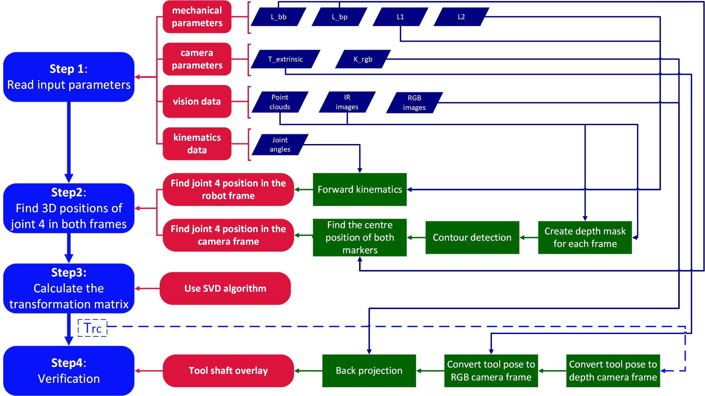

<!-- An overview of main.cc, an implementation of hand-eye calibration for the da Vinci Research Kit (dVRK) using a bespoke marker -->

# Code overview

<!-- Provide a short description to your project -->

## Files
The `src` directory comprises one `main.cc` and two other *.cc files which contain essential classes and utility functions. The `include` folder contains their corresponding header files (`*.h`). 

## Dependencies
Eigen library, OpenCV, and Point Cloud library are used in this project.

## Workflow
The workflow of `main.cc` is shown in Fig 1, which consists of four steps. Descriptions for each step and their code implementations are presented below.

|  |
|:--:|
| Fig 1. Workflow |

## Step 1: Read input parameters
### 1. Mechanical parameters
Mechanical parameters include DH parameters of the tool instrument, radii of two spherical markers, and their relative position when placed on the tool shaft. When reading input parameters, function `ReadParameter` is used. The corresponding code block is presented below

```cpp
    ReadParameter(ParameterPath, "ball_1_radius", ball_1_radius);
    ReadParameter(ParameterPath, "ball_2_radius", ball_2_radius);
    ReadParameter(ParameterPath, "l1", l1);
    ReadParameter(ParameterPath, "l2", l2);
```

### 2. Camera parameters
Camera parameters include the intrinsic matrix of the RGB lens and the extrinsic matrix between the RGB and depth lens. They are both $\textrm{4} \times \textrm{4}$ matrices with numbers of double precision, and hence we use the function `ReadMatrixFromTxt` to read data

```cpp
    ReadMatrixFromTxt(Intrinsic_path, Intrinsic_matrix);
    ReadMatrixFromTxt(Extrinsic_path, Extrinsic_matrix);
```

### 3. Vision data
Vision data includes recorded infrared images, colour images and point clouds captured by the depth camera as the instrument was being moved to different positions. We first delare a class object to process vision data. 

```cpp
    FeatureDetection DepthCamera;
```

Then we feed camera parameters into this object

```cpp
    DepthCamera.ReadIntrinsicMatrix(Intrinsic_matrix);
    DepthCamera.ReadAcusenseDepth2RGBMat(Extrinsic_matrix);
```

When reading image frames, we simply call the built-in OpenCV function `cv::imread`, and when we read point cloud input, we use the class function `FeatureDetection::ReadPointCloudPCD`.

### 4. Kinematics data
Kinematics data in this project only contains recorded joint angle positions when the instrument was being moved to different positions. These recorded positions are stored in an Eigen matrix, and hence to read these inputs we still call back the function `ReadMatrixFromTxt`.

## Step 2: Find the 3D position of joint 4 in both the robot and camera frame
### 1. Find joint 4 position in the robot frame
We can find the 3D position of joint 4 from joint angle recordings through forward kinematics by using the function `GetJoint4Position`

```cpp
    GetJoint4Position(JointAngleList, Joint4PosList_robot, l1, l2);
```

Then joint 4 positions in the robot frame is stored in `Joint4PosList_robot` as an Eigen matrix with numbers of double precision.

### 2. Find joint 4 position in the camera frame
To find joint 4 position in the camera coordinate for each frame, we need to leverage the markers and call back the public class function `FeatureDetection::ReconstructJ4Position`
```
    Eigen::Vector3d pos_j4_camera = DepthCamera.ReconstructJ4Position(img_depth, frame_cloud, ball_1_radius, ball_2_radius);
```
A detailed description for this function is presented in `FeatureDetection.md`.

We iterate through all the recorded image frames and stack the reconstructed joint 4 position into an Eigen matrix `Joint4PosList_camera`. Then we are ready to find out the transformation matrix between the camera and robot frame.

## Step 3: Calculate the transformation matrix
Using the algorithm described in `Background.md`, we created a function `SVD_rigid_transform` to find transformation matrix between two sets of 3D points

```cpp
    Eigen::Matrix4d Trc = SVD_rigid_transform(Joint4PosList_camera, Joint4PosList_robot),
                    Tcr = Trc.inverse();
```

A detailed description for this function is presented in `EigenLibraryIntro.md`.

## Step 4: Verification
To verify our calculation, we aim to overlay the 3D tool shaft onto the last image frame. With an accurate transformation matrix, the back projection of the 3D tool shaft should align with its visual observation. 

We first feed the transformation matrix into the camera object
```cpp
    DepthCamera.ReadHandEyeTransform(Tcr);
```

The central line of the tool shaft is defined by two points on the line. We choose joint 4 and the remote centre of motion (RCM), the origin point, to represent the tool shaft. The 3D positions of the RCM and joint 4 in the robot frame are `rcm_pos_robot` and `j4_pos_robot`, respectively.

Then we convert these two points into the depth camera frame via $\textrm{T} _ \textrm{cr}$

```cpp
    DepthCamera.cvt2cameraFrame(rcm_pos_robot, rcm_pos_cam);
    DepthCamera.cvt2cameraFrame(j4_pos_robot, j4_pos_cam);
```

Afterwards, we back project `rcm_pos_cam` and `j4_pos_cam` onto the colour image via the camera intrinsic matrix, and we draw a dashed line connecting these two points.

```cpp
    cv::Mat img_overlay = DepthCamera.drawShaftAxisColourAcusense(img_colour, "overlay", rcm_pos_cam, j4_pos_cam);
```

Finally, we save the overlayed image as output

```cpp
    std::string img_overlay_filename = output_folder_path + "overlay.jpg";
    cv::imwrite(img_overlay_filename, img_overlay);
```
